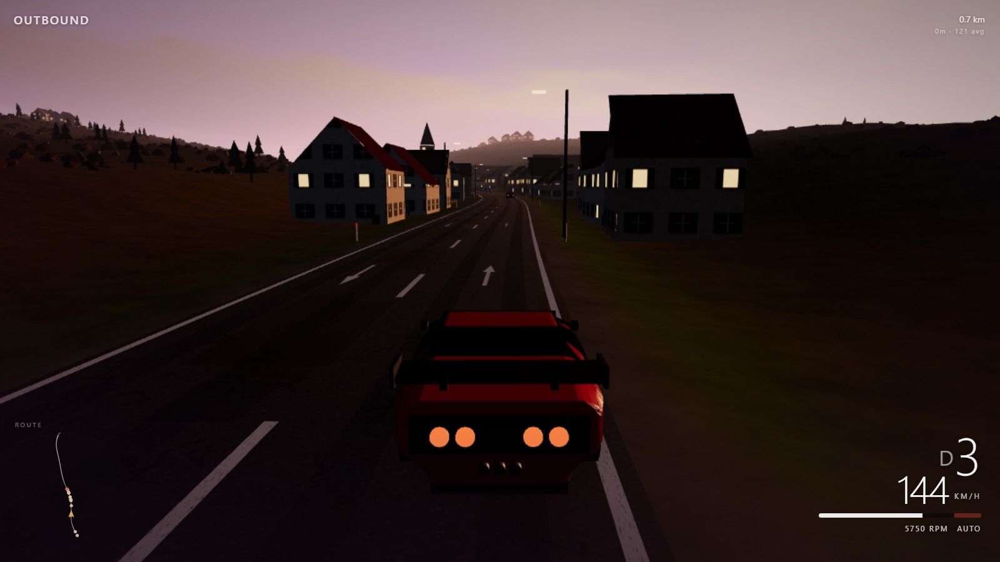

# OUTBOUND

A driving game that is one HTML file.

### [Play it &rarr;](https://netanelyan.github.io/outbound/)

[](https://netanelyan.github.io/outbound/)

No build step, no bundler, no `node_modules`, no assets directory. Every road
marking, every cloud, every panel of every car and every note of the engine is
generated at runtime from a single `index.html`. The only thing it fetches is
three.js, from a CDN.

The road is endless and procedural. You pick a car, a road, a gearbox, some
weather and how much traffic you want, and then you drive.

## Running it

It is live at **<https://netanelyan.github.io/outbound/>**, which is the whole
of the deployment: GitHub Pages serving the same `index.html` that is in this
repository.

To run your own copy, open `index.html` in a browser. That is the whole
procedure - it works straight off the filesystem, because the only import is
cross-origin and the CDN allows it.

If you would rather serve it:

```sh
python -m http.server 8000
# then open http://localhost:8000
```

It is a static file, so any static host will do.

Needs a reasonably current browser: it uses import maps and ES modules, so
Chrome/Edge 89+, Firefox 108+ or Safari 16.4+. And it needs a keyboard -
phones and tablets get a notice telling them to come back on a computer, and
the engine is never started on them.

## Controls

| | |
|---|---|
| `W` `S` *or* `↑` `↓` | throttle and brake |
| `A` `D` *or* `←` `→` | steer |
| `Space` | handbrake |
| `E` | cruise control on/off - holds the speed you were doing |
| `G` | autopilot |
| `C` | camera - chase, high and wide, bonnet |
| `H` | headlights |
| `M` | sound |
| `P` | fresh car, back on the road |
| `Esc` | back to the menu |

With the manual gearbox:

| | |
|---|---|
| `Shift` | clutch - hold it to change gear |
| `1`–`7` | pick a gear |
| `0` | neutral |
| `R` | reverse, then `S` to back up and `W` to stop |
| `T` | back to the automatic |

Money-shift it and the engine is gone until you press `P`.

## What you can choose

**Eight cars**, each with its own body, gear ratios, torque curve, mass and
handling: Ferrari F40, BMW M2, Tesla Model 3, Land Rover 90, a 1969 muscle
coupé, a Subaru Impreza, a 1962 open roadster, and a quad-turbo hypercar.

**Four roads.** *Open road* is moorland and farmed valleys with villages
through them. *Forest* is one lane each way with trees to the verge. *City* is
blocks, kerbs and street lighting. *Autobahn* is one-way, three to five lanes,
and nothing coming.

**Four kinds of weather** - morning, evening, rain, snow - which change the
light, the fog, the sky and how much grip you have.

**Two gearboxes** and **four traffic densities**, from an empty road to nose to
tail.

## How it works

Everything is procedural and everything is deterministic: the same arc length
always produces the same road, the same hills and the same village.

- **The road** is defined by its heading as a function of distance, and
  curvature is that function differentiated. The four amplitudes sum to less
  than a right angle, which means the road always makes forward progress and
  therefore cannot cross itself - the property that keeps a hillside built two
  kilometres ago from turning up on the carriageway.
- **The terrain** is rings swept along the road out to 755 m either side,
  flattened near the tarmac and growing into landform further out. The rings
  straighten as they go, or they would converge on the centre of every corner.
- **The country** turns over every few kilometres between moor - heather,
  gorse, loose stone - and farmland, which is a patchwork of fields with a
  hedge or a drystone wall on every boundary.
- **The car** is a real simulation rather than a lerp: the engine is a rotating
  inertia driven against the torque the clutch feeds back from the wheels, so
  stalling, clutch slip, rev-matching and blowing the engine on a bad shift all
  fall out of it instead of being special cases.
- **The world streams** in chunks of 180 m as you drive, and is thrown away
  behind you.

The source is heavily commented, and the comments are mostly about *why* -
what was tried, what it looked like, and what went wrong with it.

## Rendering

three.js, `MeshLambertMaterial` almost everywhere, ACES filmic tone mapping, and
geometry merged per chunk per material - a chunk's worth of houses is one draw
call, and its several hundred gorse bushes are one instanced mesh. Every texture
is drawn into a canvas at load time: tarmac, markings, ground mottle, building
facades, roof tiles, the sky. There are no image files anywhere in the project
apart from the screenshot above, and the favicon is an inline SVG in the
`<head>`.

## Licence

MIT. See [LICENSE](LICENSE).

The car names are used descriptively, to say what each one is meant to drive
like. Nothing here is affiliated with or endorsed by any manufacturer, and none
of the shapes are real CAD - they are hand-written boxes and extrusions.

three.js is BSD-3-Clause and is loaded from a CDN rather than vendored.
